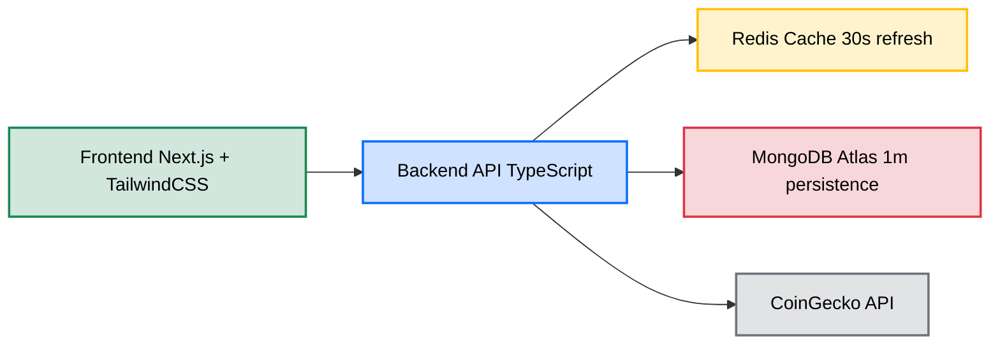

# Token Data API

## Overview
This project provides a comprehensive solution for displaying real-time token data for Ethereum and Aver AI tokens. The system integrates with the CoinGecko API for token information, uses MongoDB Atlas for persistent storage, and implements Redis for caching to improve performance and handle high concurrent user loads.

## Architecture
The application follows a layered architecture:
- Frontend: Next.js with TailwindCSS
- Backend: TypeScript-based API server
- Caching: Redis (30-second refresh)
- Database: MongoDB Atlas (1-minute persistence)
- External API: CoinGecko



## Prerequisites
- Node.js 18 or higher
- MongoDB Atlas account
- Redis (local installation required)
- CoinGecko API key: `CG-32JARN2FnAhPKaq9X68XARkgA`

## Getting Started

### 1. Redis Setup
The application requires Redis to be running locally:

```bash
# Install Redis (Ubuntu/Debian)
sudo apt-get install redis-server

# Install Redis (macOS with Homebrew)
brew install redis

# Start Redis server
redis-server

# Start Redis server (macOS with Homebrew)
brew services start redis

# Verify Redis is running
redis-cli ping
# Should return "PONG"
```

### 2. Clone and Install

```bash
# Clone the repository
git clone https://github.com/JuanGaljoen/crypto-app.git
cd crypto-app

# Install dependencies
npm install
```

### 3. Environment Setup
Create a `.env` file in the root directory:

```
# API Keys
COINGECKO_API_KEY=CG-32JARN2FnAhPKaq9X68XARkgA

# Database
MONGODB_URI=your_mongodb_atlas_connection_string

# Redis
REDIS_URL=redis://localhost:6379

# Server
PORT=5001
```

### 4. Running the Application

```bash
# Start the backend server
npm run dev

# In a separate terminal, start the frontend
npm run dev
```

The application will be available at `http://localhost:3000`

## Features
- Real-time token data display for Ethereum and Aver AI
- OHLC chart visualization for the last 7 days
- Automatic data refresh every 30 seconds
- High-performance caching layer with Redis
- Persistent storage with MongoDB Atlas

## API Endpoints

### GET /api/tokens
Returns current price information for Ethereum and Aver AI tokens.

### GET /api/tokens/:id/ohlc
Returns OHLC (Open, High, Low, Close) data for the specified token for the last 7 days.

## Testing

```bash
# Run all tests
npm test

# Run specific test categories
npm run test:api
npm run test:db
npm run test:cache
npm run test:security
```

## Performance Considerations
- The free CoinGecko API has a rate limit, so it might timeout for 60 seconds if limit is reached.
- Redis caching reduces load on the CoinGecko API and improves response times
- Efficient data formatting and transfer between layers

## TODO: Potential Future Features

- User authentication system with personalized watchlists
- Price alerts and notifications via email or push notifications
- Additional token support with customizable dashboard
- Historical data analysis with advanced chart visualization options
- Portfolio tracking with performance metrics
- Dark/light theme toggle
- Export functionality for data in CSV/JSON formats
